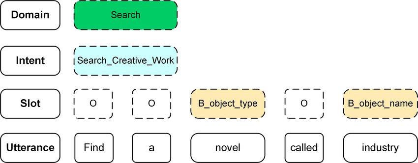
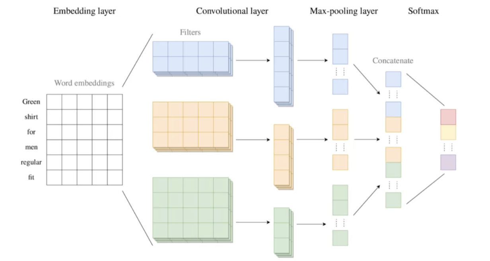
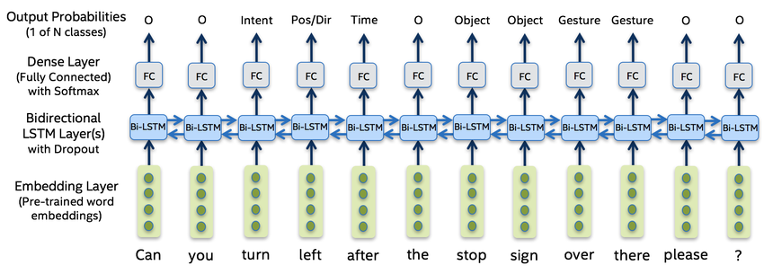
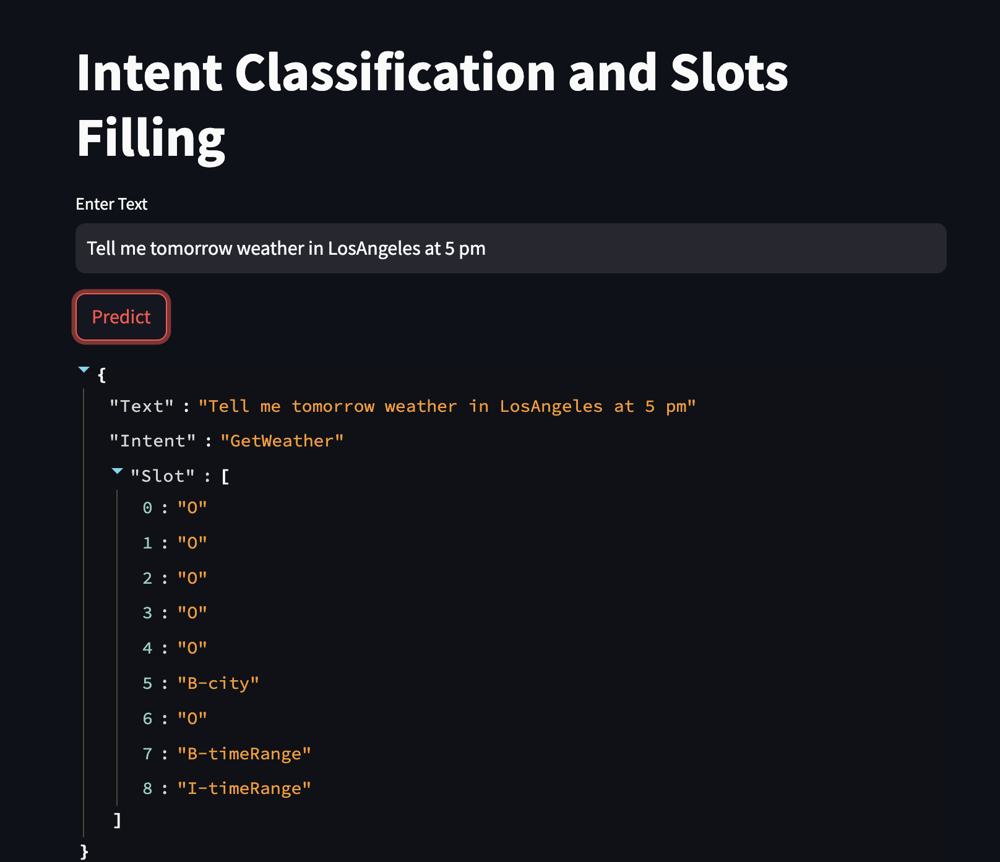

# Natural Language Understanding (NLU)
This project focuses on Natural Language Understanding (NLU), a critical component of conversational AI systems. The primary goal is to develop and train models that can accurately interpret user input (utterances) to extract intents and identify specific entities or slots within the text.

## Problem Statement
The problem revolves around the challenge of understanding user queries or statements in natural language. It involves:

- Extracting the intention behind user input: Given diverse user utterances, the system needs to accurately identify the user's intent or purpose, such as querying weather information, making reservations, playing music, etc.
- Recognizing entities or slots: Understanding and categorizing specific entities within the user input, such as dates, locations, names, quantities, etc., using techniques like Named Entity Recognition (NER) with the BIO tagging scheme (Beginning, Inside, Outside).


Reference:https://www.researchgate.net/figure/shows-an-example-utterance-from-the-Snips-dataset-Find-a-novel-called-industry-with-a_fig1_337405537

## Dataset
The dataset (train.json,valid.json) contains examples of user utterances along with associated intents and slot annotations, serving as the foundation for model training and evaluation.
Reference:https://www.kaggle.com/competitions/hackathon-online-nlu-intent-classification/overview

## Solution
### Intent Classification using CNN (Convolutional Neural Network)
The CNN model architecture for intent classification involves processing text data to determine the intent behind a user query or sentence.


Reference:https://machine-learning-company.nl/en/technical/convolutional-neural-network-text-classification-with-risk-assessment-eng/

1.Word Embedding: Initially, the text data is converted into numerical representations using word embedding. This step maps words in the input text to dense vectors.

2.Convolutional Layers: Convolutional layers perform feature extraction by applying filters to capture different patterns in the input sequences. In this case, 1D convolutional layers are used to identify relevant features within the text data.

3.Pooling Layer: The GlobalMaxPooling1D layer extracts the most important features from the convolutional layers, condensing the information into a fixed-size vector.

4.Dense Layers with Dropout and Regularization: These fully connected layers interpret the condensed features obtained from earlier layers for final classification into different intent categories. Dropout layers prevent overfitting, while regularization helps control the complexity of the model.

5.Softmax Activation: The output layer uses a softmax activation function to provide probability scores for each intent category, allowing the model to predict the most likely intent for a given input.

### Slot Filling using BiLSTM (Bidirectional Long Short-Term Memory)
The BiLSTM model architecture is used for sequence labeling, specifically for slot filling tasks, where the goal is to identify and label specific parts of a sentence with corresponding tags.


Reference:https://www.researchgate.net/figure/Seq2seq-Bi-LSTM-Network-for-Slot-Filling-and-Intent-Keyword-Extraction_fig1_332630566

1.Word Embedding: Similar to intent classification, the input text undergoes an embedding process to convert words into dense vector representations.

2.Bidirectional LSTM: This layer uses a Bidirectional Long Short-Term Memory network, which processes the input sequence in both forward and backward directions. This bidirectional nature allows the model to capture contextual information from both past and future elements in the sequence.

3.Dropout Layer: Dropout is applied to prevent overfitting by randomly dropping a fraction of input units during training.

4.TimeDistributed Dense Layer: This layer applies a dense (fully connected) neural network to each temporal slice of the input sequence independently, producing output predictions for each time step.

5.Softmax Activation: The TimeDistributed Dense layer with softmax activation assigns probability scores for different slot labels or tags to each word/token in the input sequence.

## Deployment
Clone this repo and run the below docker command:
`Start Application:`
```docker
docker-compose up -d --build
```
and navigate to http://localhost:8501/
`Stop Application:`
```docker
docker-compose down
```
Dockerfile and environment configuration are included in ui and service folder. Models are deployed with FastAPI.
Streamlit deployment sample


## Limitation and Issues
- The trained intents are restricted to: GetWeather, PlayMusic, RateBook, BookRestaurant, SearchCreativework, SearchScreeningEvent, and AddtoPlaylist.
- This model only supports English.
- Alternatively, you can utilize pre-trained models such as BERT, ATIS, or SNIPS for intent classification and slot filling.

## Cloud Deployment
Before proceeding, ensure you have installed the [Google Cloud SDK](https://cloud.google.com/sdk/docs/install)
**Tag Docker Images:** Tag each Docker image with the following command:
```docker
docker tag SOURCE-IMAGE LOCATION-docker.pkg.dev/PROJECT-ID/REPOSITORY/IMAGE:TAG
```
**Push to Artifact Registry:** After tagging the image, push it to Google Cloud Artifact Registry using the following command:
```docker
docker push LOCATION-docker.pkg.dev/PROJECT-ID/REPOSITORY/IMAGE:TAG
```
**Deploy to Cloud Run:**To deploy your tagged Docker image to Cloud Run, use the `gcloud run deploy` command:
```bash
gcloud run deploy --image=us-docker.pkg.dev/project/image
```
