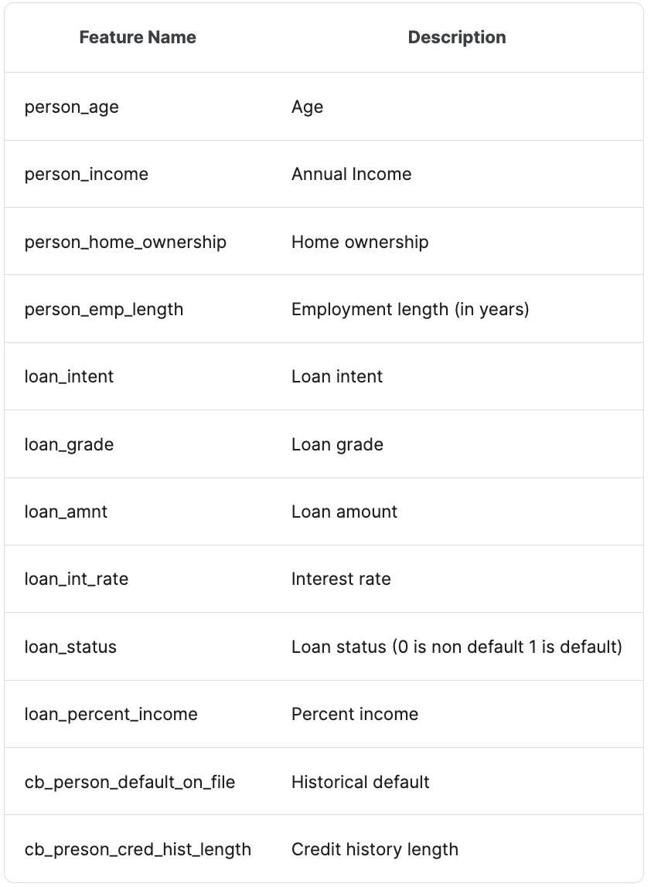

# Loan risk prediction

This is my midterm project in machine learning for Zoomcamp 2023. Please check out my code. Enjoy! :blush:

## Problem
The problem at hand is to develop a loan risk prediction system that assesses the creditworthiness of individuals applying for loans based on their personal information. Preventing loan defaults is crucial for financial institutions and lenders, as defaults can have significant negative impacts on their financial health and overall operations.:money_with_wings:

## Goal
The goal is to determine whether an applicant is likely to default on the loan, providing financial institutions with a reliable tool to mitigate risk and make informed lending decisions. :chart_with_upwards_trend:

## Dataset
- [Loan risk data](https://www.kaggle.com/datasets/laotse/credit-risk-dataset/data)

## Setting environment
Start by using this command`pip install pipenv` to install the pipenv package. Then run this command `pipenv install -r requirements.txt` to create [Pipfile](Pipfile) and [Pipfile.lock](Pipfile.lock).
* The Pipfile is a human-readable configuration file where you specify the dependencies for your Python project.
* The Pipfile.lock is essential for ensuring that your project's dependencies are consistent across different environments and over time
To start the virtual environment you created just run this command:`pipenv shell`

## EDA/Experiment/Model Selection
[Notebook](loan_risk_pred.ipynb)
I finally chose the XGBoost Classifier, and I saved my preprocessing pipeline and the classifier model here. [Save model packages](model.bin)

## Run using python script
* If you are unsure about the required libraries, please download [requirements.txt](requirements.txt) and then using this command `pip install -r requirements.txt` in command line
* Run this command `python train.py` in your terminal, and ensure that your current directory path includes [train.py](train.py).  This script will generate[model](model.bin)as an output
* After obtaining the [model](model.bin). You can start running `python predict.py` in your terminal to obtain customer default probability output. Make sure that your current directory path includes [predict.py](predict.py). You can adjust customer features within this Python file.

## Deployment with Flask
* You can run script [predict_flask.py](predict_flask.py) to get the endpoint. Then you can try open [test_flask_deployment.ipynb](test_flask_deployment.ipynb) to post a request to the endpoint